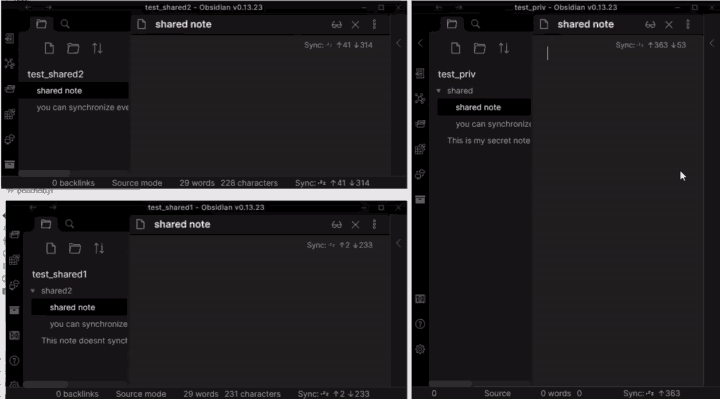

# LiveSync classroom



## What is this?

This is the custom replicator of Self-hosted LiveSync's remote vault to share Obsidian's vault or backup.

It can synchronize documents between vaults,
having different structures and different passphrases.

And, you can synchronize documents under the specified folder,
to another vault's specified one.

Of course, ~~bi-~~ multi-directional!

# How to use
## Simply run

1. Clone the GitHub Repository
```git
git clone https://github.com/vrtmrz/livesync-classroom.git
```
2. Open the config file dat/config.sample.json, edit and save to dat/config.json

3. Simply run as like this.
```bash
$ npm i -D
$ npm run dev
```

# Docker Instructions

1. Clone the GitHub Repository
```git
git clone https://github.com/vrtmrz/livesync-classroom.git
```
2. Open the cloned directory
```bash
cd livesync-classroom
```
3. Open the config file dat/config.sample.json, edit and save to dat/config.json
4. Build the Dockerfile
```bash
sudo docker build -t obsidian-livesync-classroom .
```
5. Create the docker container
```bash
sudo docker-compose up -d
```
# Configuration

The configuration file consists of the following structure.

```jsonc
{
    // "config_1" is just the name for identifying the connection.
    "config_1": {
        // "private" and "shared" don't mean which is primary or not.
        // They are even. But I made so many misconfigurations while debugging
        // with the names "database_a" and "database_b",
        // so it was just named as like this.
        "private": { 
            "uri": "http://localhost:5984/private1_vault",
            "auth": {
                "username": "username_of_private_vault",
                "password": "password_of_private_vault",
                "passphrase": "passphrase_of_private_vault"
            },
            "path": "shared/" // Shared folder
        },
        "shared": {
            "uri": "http://localhost:5984/shared_vault",
            "auth": {
                "username": "username_of_shared_vault",
                "password": "password_of_shared_vault",
                "passphrase": "passphrase_of_shared_vault"
            },
            "path": ""
        }
    },
    // You can set up multiple vault syncing.
    "config_2": {
        "private": {
            "uri": "http://localhost:5984/private2_vault",
            "auth": {
                "username": "username_of_private_vault",
                "password": "password_of_private_vault",
                "passphrase": "passphrase_of_private_vault"
            },
            "path": "shared/"
        },
        "shared": {
            "uri": "http://localhost:5984/shared_vault",
            "auth": {
                "username": "username_of_shared_vault",
                "password": "password_of_shared_vault",
                "passphrase": "passphrase_of_shared_vault"
            },
            "path": ""
        }
    }
}
```
## Realistic example

| name                       | database_uri                              | CouchDB username | CouchDB password | vault E2EE passphrase | sharing path |
| -------------------------- | ----------------------------------------- | ---------------- | ---------------- | --------------------- | ------------ |
| private vault of Cornbread | http://localhost:5984/classroom_cornbread | cornbread        | tackle           | glucose               | shared/      |
| shared vault               | http://localhost:5984/classroom_shared    | common_user      | resu_nommoc      | cocoa                 |              |
| private vault of Vanilla   | http://localhost:5984/classroom_vanilla   | vanilla          | liberty          | smock                 | kyouyuu/     |

Cornbread's every document under "shared" synchronized with top of the shared vault:

| Cornbread          | shared            |
| ------------------ | ----------------- |
| document1          | *Not transferred* |
| document2          | *Not transferred* |
| shared/shared_doc1 | shared_doc1       |
| shared/sub/sub_doc | sub/sub_doc       |

Vanilla's every document under "kyouyuu" synchronized with top of the shared vault:

| Vanilla                  | shared            |
| ------------------------ | ----------------- |
| documentA                | *Not transferred* |
| documentB                | *Not transferred* |
| kyouyuu/some_doc         | some_doc          |
| kyouyuu/sub/some_sub_doc | sub/some_sub_doc  |

Totally synchronized like this:

| Cornbread               | shared            | Vanilla                  |
| ----------------------- | ----------------- | ------------------------ |
| document1               | *Not transferred* |                          |
| document2               | *Not transferred* |                          |
|                         | *Not transferred* | documentA                |
|                         | *Not transferred* | documentB                |
| shared/shared_doc1      | shared_doc1       | kyouyuu/shared_doc1      |
| shared/some_doc         | some_doc          | kyouyuu/some_doc         |
| shared/sub/some_sub_doc | sub/some_sub_doc  | kyouyuu/sub/some_sub_doc |
| shared/sub/sub_doc      | sub/sub_doc       | kyouyuu/sub/sub_doc      |

... with the configuration below:

```json
{
    "cornbread_to_shared": {
        "private": {
            "uri": "http://localhost:5984/classroom_cornbread",
            "auth": {
                "username": "cornbread",
                "password": "tackle",
                "passphrase": "glucose"
            },
            "path": "shared/"
        },
        "shared": {
            "uri": "http://localhost:5984/classroom_shared",
            "auth": {
                "username": "common_user",
                "password": "resu_nommoc",
                "passphrase": "cocoa"
            },
            "path": ""
        }
    },
    "vanilla_to_shared": {
        "private": {
            "uri": "http://localhost:5984/classroom_vanilla",
            "auth": {
                "username": "vanilla",
                "password": "liberty",
                "passphrase": "smock"
            },
            "path": "kyouyuu/"
        },
        "shared": {
            "uri": "http://localhost:5984/classroom_shared",
            "auth": {
                "username": "common_user",
                "password": "resu_nommoc",
                "passphrase": "cocoa"
            },
            "path": ""
        }
    }
}
```
